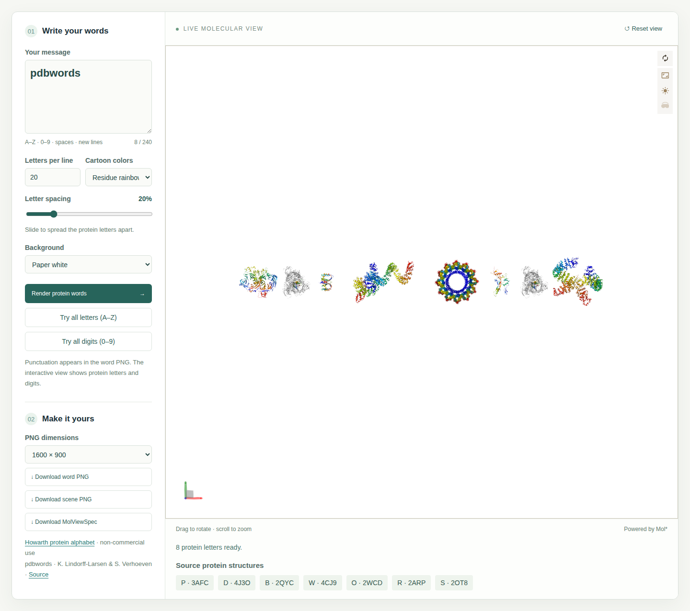
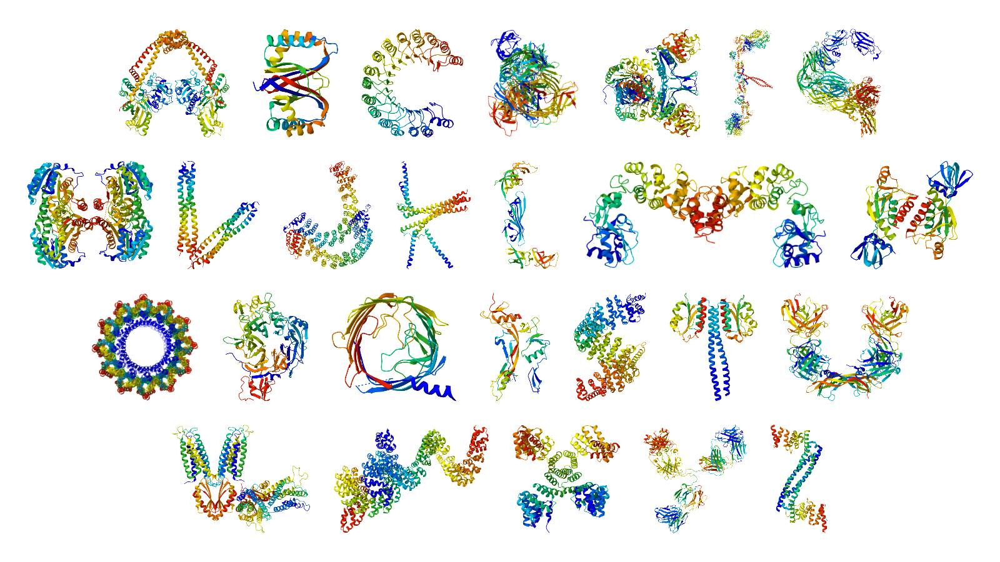
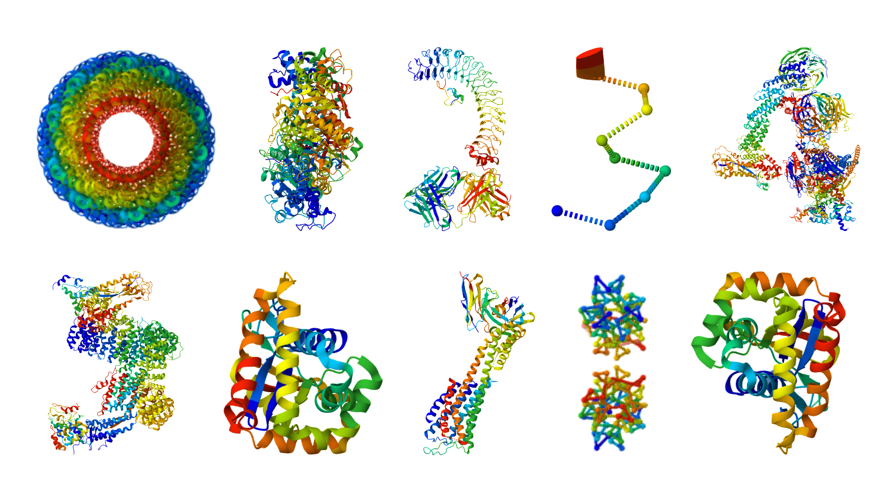

# pdbwords



Write messages with protein letters and digits in a static TypeScript app using
Mol* and MolViewSpec. The app renders interactive molecular scenes and exports
word PNGs, scene PNGs, and portable MolViewSpec files.

The original protein alphabet was curated by Mark Howarth, and the original
program was written by Kresten Lindorff-Larsen in 2015. This repository now
contains the JavaScript app; Python is used only for asset maintenance.

Use Node 24 and pnpm 12.9.1 (both pinned for CI):

```sh
pnpm install --frozen-lockfile
pnpm exec vp dev
pnpm exec vp check
pnpm exec vp test run
pnpm exec vp build
pnpm exec vp preview
```

The equivalent global CLI commands are `vp install`, `vp dev`, `vp check`,
`vp test run`, and `vp build`. The local Vite+ version is locked at 1.0.0.
Open `/pdbwords/` on the development/preview server. Set `PAGES_BASE=/` when
building for a custom domain, or `/another-repository/` for a renamed repo.

## Rendering and export

The “Try all letters (A–Z)” button fills a four-line alphabet example and renders
it automatically.
“Try all digits (0–9)” does the same for a two-line digit example.

Downloaded word PNGs from these examples:





The app imports `src/manifest.json` directly; there is no
second geometry manifest. It preserves the Python column-major transforms,
whole-word wrapping, line spacing, author chain identifiers and residue color
ranges. The extractor selects only protein atoms shown as cartoons in the
original sessions: hidden chains are excluded, including for D, E, and O.
Newlines and the case-sensitive `xLBx` token are line breaks. Letters A–Z and
digits 0–9 are supported; characters outside these, whitespace, and `.,:!?-`
produce explicit errors.
Punctuation occupies spacing in 3D but is visibly reported as omitted.

Digits use the manifest's approved biological assemblies and camera orientations,
including the PyMOL view for 6. Compact BCIF source files come from RCSB and
Mol* constructs the biological assemblies from their operators; protein
bounds are measured in the saved view and scaled to the height of A.
The resolved geometry and coordinate downloads are cached for the session.
Digits work in the interactive scene, both PNG exports, and portable MVSJ exports.

Coordinates come from `https://models.rcsb.org/{PDB_ID}.bcif`, with a maximum
of three parallel downloads and a session cache. Each repeated letter shares
one parsed structure and uses separate MolViewSpec instances. Old scenes are
replaced; edited inputs invalidate downloads, and obsolete renders are ignored.
A reload releases the cache. Internet access is required; this is not an
offline application.

Scene PNG captures the current rotation and zoom at the chosen dimensions.
Word PNG uses a separate offscreen Mol* viewer to render distinct letters with
transparent alpha, crops their actual silhouettes, and normalizes tile heights.
The punctuation PNGs come from the existing alphabet assets. Tile cache keys
include letter, style, resolution and background and have a bounded size.
Both outputs have exact chosen dimensions. No PNG provenance metadata is
injected; provenance, source URLs, and attribution are in the MVSJ download.
MVSJ uses portable RCSB URLs for letters and embedded normalized BCIF for digits,
with the original assembly URLs and scale factors recorded in its description.
Digit exports can be larger because they include those coordinates.

Letter spacing updates the scene automatically after a short debounce and is included
in both PNG layout and MVSJ transforms.

The camera is orthographic and framing uses transformed bounds including
native depth. The initial message limit is 240 characters; PNG options are
1200×1200, 1600×900 and 2400×1350. These are conservative UI limits rather than
universal performance guarantees across mobile GPUs.

Mol* uses coordinate secondary-structure annotations for experimental PDB
structures. Its automatic secondary-structure provider can compute DSSP for
other atomic models, but does not guarantee a fallback for every experimental
structure missing annotations. Source-coordinate changes can affect appearance.

## Validation

Unit tests check text validation, scene geometry, saved camera orientations,
assembly scaling, and digit exports. Python tests cover the maintenance scripts. To run
production-browser tests:

```sh
pnpm exec vp build
pnpm exec playwright install chromium firefox webkit
pnpm exec playwright test
```

Tests use the production `/pdbwords/` subpath, render A/B/D/O, digits 3/6, and A–Z, exercise
both PNGs and MVSJ, and cover network and WebGL failures. Chromium, Firefox and
mobile WebKit are configured. The live coordinate integration tests require
RCSB access. `CHROMIUM_PATH` can select an existing Chromium executable.
On Linux CI, Firefox runs with a virtual display and Mesa software rendering:

```sh
CI=true LIBGL_ALWAYS_SOFTWARE=1 xvfb-run --auto-servernum pnpm exec playwright test
```

## Extraction and publication

The maintained Python scripts are `scripts/build_letters.py` (regenerate the
original letter PNGs) and `scripts/extract_manifest.py` (extract letter geometry
from the official PyMOL sessions). [uv](https://docs.astral.sh/uv/) manages their
Python interpreter, Pillow, `pymol-open-source==3.2.0a0`, pytest, and Ruff using
`pyproject.toml`, `uv.lock`, and `.venv`. pnpm manages only JavaScript dependencies.
The browser runtime and JavaScript build do not require Python.

```sh
uv sync --locked
uv run python scripts/build_letters.py --sessions AlphabetPDB.zip
uv run python scripts/extract_manifest.py --sessions AlphabetPDB.zip
uv run pytest
uv run ruff check scripts
```

The `assets:build`, `manifest:extract`, and `test:python` pnpm scripts delegate to
uv as conveniences. Both maintenance scripts default to root `assets/` and
`src/manifest.json`. The extractor updates A–Z geometry while preserving manually
reviewed digit entries. Original letter PNGs supply spacing measurements;
punctuation PNGs are used by the browser. Alternative PyMOL themes remain
maintainer reference assets. There is no Python CLI, wheel, or PyPI publication.

`web-checks.yml` checks and tests the app. `pages.yml` prepares manual Pages
publication; enable GitHub Pages with the Actions source and review `dist`
and the attribution before running it. No publication is triggered by a push.

Code is GPL-3.0-or-later. Mark Howarth's alphabet assets have separate
non-commercial terms; see `ASSET_LICENSE.md` and the
[Howarth alphabet page](https://www.howarthgroup.org/alphabet).
Coordinates are credited to RCSB PDB and the original structure authors via
linked source PDB IDs. Mol* is MIT licensed.

## Coordinate measurements

`pnpm run measure:coordinates` refreshes the recorded source sizes,
checksums, author CA ranges, and secondary-structure counts in
`measurements/coordinates.json`. All 26 sources measured on 2026-09-30
allowed cross-origin access (`*`), supplied helix/sheet annotations, and matched
the manifest CA ranges for every selected chain. Whole-chain selection therefore
reproduces those author ranges. Total decoded BCIF download size was 20.90 MB;
O alone was 5.58 MB. Per-request measurements ranged from 119 to 1427 ms on this
development connection; other networks and devices will differ. Remote delivery
remains the default; the hashes record measured data, not enforced coordinate pins.
