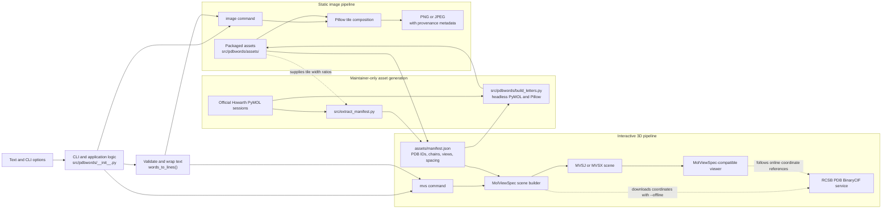

# pdbwords

`pdbwords` writes text using the protein alphabet curated by Mark Howarth. The
letters are protein structures from the Protein Data Bank, rendered to resemble
the Latin alphabet.

The original program was written by Kresten Lindorff-Larsen at the University
of Copenhagen in 2015. This version uses modern Python packaging and Pillow, so
ImageMagick is no longer required.

## Usage

[Install uv](https://docs.astral.sh/uv/getting-started/installation/), then run:

```console
uv run pdbwords image Just write your text here
```

For example, turn a short message for the life-sciences community into a
shareable protein word:

```console
uv run pdbwords image --output ai4ls.png AI FOR LS
```


The result is written to `proteinword.jpg`. Choose another output path, line
length, or letter height with:

```console
uv run pdbwords image --output message.png --max-chars 20 --height 500 Hello protein world!
```

Four PyMOL rendering themes are bundled. Select one with `--theme`:

```console
uv run pdbwords image --theme tube Hello protein world!
```

Each preview renders the same word, `PROTEIN`:

| Theme | Preview |
| --- | --- |
| `classic` |  |
| `loop` |  |
| `oval` |  |
| `tube` |  |

For an interactive 3D word, create a MolViewSpec file and open it in a
[MolViewSpec-compatible viewer](https://molviewspec.github.io/):

```console
uv run pdbwords mvs --output message.mvsj Hello protein world!
```

An `.mvsj` file references BinaryCIF structures hosted by RCSB PDB. An `.mvsx`
file can also reference those online structures, or bundle all required
coordinates for offline use:

```console
uv run pdbwords mvs --output message.mvsx --offline Hello protein world!
```

Repeated letters are represented as rigidly transformed instances of one
downloaded structure. Each structure remains interactive, retains its source
PDB ID in a tooltip, and uses a residue-based rainbow cartoon representation.
The generated scene is centered and spaced from geometry extracted from the
original PyMOL camera views. MolViewSpec only permits rigid structure transforms,
so 3D letter heights reflect the source structures' coordinate scales rather
than the normalized static tiles. Cartoon implementations also differ between
PyMOL and Mol*, so the 3D scene approximates rather than pixel-matches the static
alphabet.

Use the case-sensitive token `xLBx` to force a line break:

```console
uv run pdbwords image First line xLBx Second line
```

Letters A-Z and the punctuation `. , ! ? : -` have dedicated images. Input is
case-insensitive. Unsupported characters are replaced with a space and reported
on standard error. Words longer than the configured line length remain intact.

Generated PNG files contain `Description`, `Software`, and `PDB IDs` text
metadata. JPEG files store the same provenance in their EXIF description and
software fields. The PDB mapping follows the A-Z table on the Howarth alphabet
page and lists each letter used in the image.

## Architecture



The installed command needs only Pillow and the packaged assets. PyMOL is
isolated to the maintainer scripts that regenerate those assets; it is not part
of either runtime pipeline.

## Development

Install all dependencies and run the test suite:

```console
uv sync
uv run pytest
```

Build the source distribution and wheel, then publish them to PyPI:

```console
uv build
uv publish
```

The alphabet assets and shared geometry manifest are included in both
distributions and installed with the command, so a published wheel does not
depend on files from this repository.

### Rebuilding the letters

The Howarth Lab publishes the original A-Z PyMOL sessions, which preserve the
molecular assemblies, representations, colors, and camera views. Rebuild the
classic theme as 1000-pixel-high, transparent, lossless PNGs with:

```console
uv run --script src/pdbwords/build_letters.py
```

The script downloads the official session archive, verifies its SHA-256 digest,
ray-traces every letter in headless PyMOL, trims transparent margins, and writes
`src/pdbwords/assets/a.png` through `src/pdbwords/assets/z.png` plus a transparent
space tile. Use `--sessions AlphabetPDB.zip` to supply an existing archive, or
inspect all options with `--help`. PyMOL is included in the development
dependency group and the script's isolated dependencies, but is not installed
with `pdbwords` or required at runtime.

Regenerate a complete alternative theme with, for example:

```console
uv run --script src/pdbwords/build_letters.py --theme tube
```

Alternative themes are written below `src/pdbwords/assets/themes/`. Use
`--letters` to regenerate a subset of the alphabet.

PNG is used as the master format because it is lossless and supports alpha
transparency. Lossless WebP can be smaller, but would add a conversion step and
has less universal tooling support; JPEG cannot preserve transparency and adds
artifacts around fine cartoon edges. PNG word output preserves transparency,
while JPEG word output is flattened onto white.

The shared `src/pdbwords/assets/manifest.json` records the source PDB IDs,
enabled chains, residue ranges, saved camera rotations, projected bounds, and
visual spacing. Regenerate its letter geometry directly from the official
sessions with:

```console
uv run --python 3.11 src/extract_manifest.py --sessions AlphabetPDB.zip
```

The image builder checks each session against this manifest. The static and 3D
renderers use the same proportional spacing metadata, while the 3D renderer also
applies the saved rotations and projected centering.

## Background and license

Mark Howarth describes the alphabet, its protein structures, and the original
publication at <https://www.howarthgroup.org/alphabet>. The site permits the
alphabet files to be used freely for non-commercial purposes.

The Python code is distributed under the GNU General Public License v3.0 or
later; see [`LICENSE`](LICENSE). The bundled alphabet images retain Mark
Howarth's copyright and non-commercial-use terms; see
[`ASSET_LICENSE.md`](ASSET_LICENSE.md).

The use of AI assistance in modernizing this project is documented in
[`aidecl.yml`](aidecl.yml), following the [AI Declaration](https://ai-declaration.org/)
schema.
